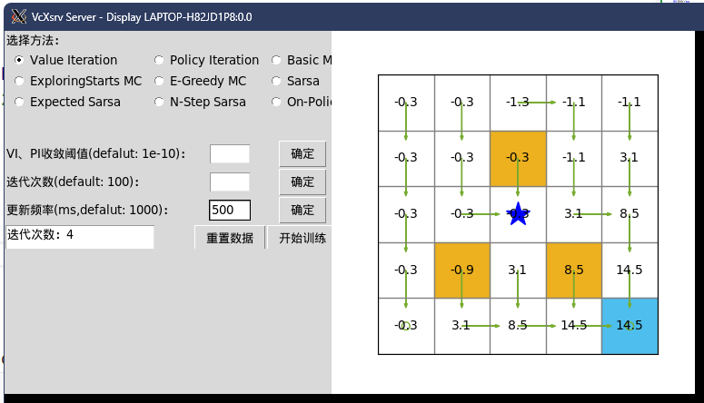

# docker-for-RL

# 1 可视化效果




# 2 安装步骤

## 2.1 使用dockerfile构建基础镜像

```
docker build -t myimage:v1.0 .
```

随后在docker desktop中运行镜像，记得挂载目录并填入显示图形界面所需的环境变量。

## 2.2 安装所需环境

首先复制The_Coding_Foundation_in_Reinforcement_Learning文件夹至你容器的挂载目录内，随后安装环境：

```
cd /workspace/The_Coding_Foundation_in_Reinforcement_Learning
apt-get update
apt-get install python3.8
pip install python3-tk gym numpy matplotlib torch -i https://pypi.tuna.tsinghua.edu.cn/simple
# 下面这段安装图形显示的中文支持
apt-get install x11-apps
apt-get -y install locales xfonts-intl-chinese fonts-wqy-microhei  
dpkg-reconfigure locales
```

安装完毕后，在项目根目录下运行examples/main.py ，您应能看到图形界面并与之交互。

部分代码可能存在bug，源项目地址：https://github.com/SupermanCaozh/The_Coding_Foundation_in_Reinforcement_Learning